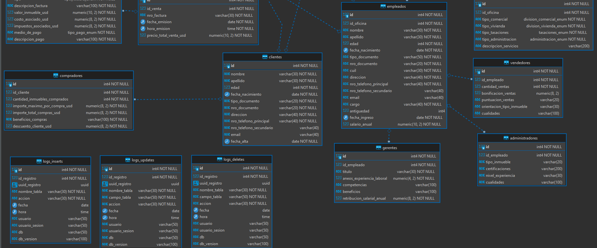

# Proyecto db_inmobiliaria con PostgreSQL.
En este proyecto se pone en práctica el Diseño, Modelado, Creación, Desarrollo, Programación, Gestión y Administración de una Base de Datos acerca de una Inmobiliaria con el SGBD PostgreSQL.


<br>

## Índice 📜 

<details>
 <summary> Ver </summary>
 
 <br>
 
### Sección 1) Descripción, Tecnologías y Ejecución

 - [1.0) Descripción del Proyecto.](#10-descripción-)
 - [1.1) Ejecución del Proyecto.](#11-ejecución-del-proyecto-)
 - [1.2) Tecnologías.](#12-tecnologías-)
 - [1.3) Relaciones de Tablas.](#13-relaciones-de-tablas-)
 - [1.4) Restricciones de Tablas.](#14-restricciones-de-tablas-)
 
  
### Sección 2) Prueba de Funcionalidad y Referencias
 
 - [2.0) Prueba de Funcionalidad.](#20-prueba-de-funcionalidad-)
 - [2.1) Referencias.](#21-referencias-)

<br>

</details>


<br>

## Sección 1) Descripción, Tecnologías y Ejecución 


### 1.0) Descripción [🔝](#índice-) 

<details>
  <summary>Ver</summary>
 
 <br>
 
* El Desarrollo surgió a partir de una pequeña db a modo de ejemplo de un pdf, el mismo me orientó en la estructura relación-entidad de la db con PostgreSql para una inmobiliaria. Todo el desarrollo fue creado desde cero y guiándome por las informaciones y características del mercado Inmobiliario en Argentina (valores, precios, medidas, léxico, etc).
*  Las páginas de inmobiliaria más conocidas en las que me guíe son zonaprop, re/max y baigún.
*  Para la gran mayoría de las medidas tomadas en inmuebles me guié en anuncios en MercadoLibre, ya que allí se detallan en mayor cantidad.
*  Se incluye el pdf guía del proyecto dentro de la documentacion.

## Descripción Técnica

* Se aplica un Diseño Normalizado, se separan las tablas que contengan varios campos y se aplica la convención de nombres, tanto para tablas, campos, registros, funciones, etc.
* Para el Modelado se aplican relaciones de Uno a Uno y relaciones de Uno a Varios. Posteriormente a esta descripción se anexa el DER de la db junto con la descripción de Relaciones de Tablas.
* Dentro de la Creación y Desarrollo de la sección DDL(Data Definition Language) se aplican todas las Restricciones/ CONSTRAINT correspondientes para cada uno de los campos desarrollados, las mismas incluyen los tipos UNIQUE, se aplican los PRIMARY KEY Y FOREIGN KEY  para la relación de tablas, además de los tipos CHECKS para comprobación de valores de campos.
* Dentro de la sección del DML(Data Manipulation Language) se comienza con la Programación de la Base de Datos, generando funciones que nos permitan insertar, actualizazr y eliminar registros de la forma requerida y deseada. Sigo el mismo patrón de inserción para cada registro, se agregan los datos a cada tabla y por cada registro insertado se agrega la información del Usuario y de la db en tablas de tipo logs no temporales( INSERTS, UPDATES, DELETES ) 
* La Creación de las Funciones y la Ejecución de las Mismas se desarrollan en Archivos separados
* Se aplica un Nivel de Seguridad de Respaldo con la creación de tablas y funciones para almacenar todos los cambios que se generen en la Base de Datos. Es evidente que se podría generar tablas temporales o trabajar con el propio sistema de log de PostgreSql, pero se aplica una administración a Nivel más Bajo de esta db y se crean estas tablas por gusto y manejo. Cabe aclarar que las funciones que se desarrollaron se aplican siempre que se borre, actualice o agregue un registro y se almacena dicha información en tablas individuales
* El Proyecto está separado por varios archivos .sql enumerados para facilitar la comprensión del desarrollo y la ejecución de los mismos.	

<br>

</details>


### 1.1) Ejecución del Proyecto [🔝](#índice-)

<details>
  <summary>Ver</summary>
  
 <br>  
  


</br>


#### 1.1.0) Descarga

* [Descargar DBeaver](https://dbeaver.io/)
* Ejecutar e Instalar (Siguiente, Siguiente).
* [Descargar PostgreSQL](https://www.postgresql.org/download/)
* Ejecutar e Instalar (Siguiente, Siguiente).


#### 1.1.1) Configuración de PostgreSQL en DBeaver (Conexión a PostgreSQL).
* Click sobre la Pestaña Archivo.
    * --> Nuevo
    * --> Database Connection, Siguiente.
    * --> Seleccionar el SGDB PostgreSQL, Siguiente.
    * --> En el Host dejamos como aparece `localhost`
    * --> En Database dejamos como aparece `postgres`
    * --> El resto lo dejamos todo por defecto ( Host, Port, etc ).
    * --> Finalizar, asegurarse que se haya creado la conexión a Postgres correctamente
    * --> Ya está la conexión configurada.


#### 1.1.2) Creación de la Base de Datos `db_inmobiliaria` en la Conexión de PostgreSQL
#### ( En DBeaver tuve problemas al incluir código sql para la creación de la db, así que vamos a crear la db manualmente)
* Una vez realizado el paso anterior, se debería haber desplegado la Conexión PostgreSQL, sino desplagar para visualizar 
*  Click Der sobre la conexión creada `postgres`
    * --> Crear, Base de Datos
    * --> En Database Name colocamos `db_inmobiliaria`.
    * --> En owner Seleccionamos postgres o dejarlo seleccionado por defecto.
    * --> Template database vacío.
    * --> En Encoding Seleccionamos UTF8 o dejarlo seleccionado por defecto.
    * --> Tablespace pg_default o dejarlo seleccionado por defecto.
    * --> Aceptar, ya está la db creada.


#### 1.1.3) Creación de una Conexión Independiente de la Base de Datos `db_inmobiliaria`
* Ya tenemos creada la conexión con Postgres y nuestra base de datos, ahora podemos crear una conexión independiente para su uso, cuestión de comodidad
* Click sobre la Pestaña Archivo.
    * --> Nuevo
    * --> Database Connection, Siguiente.
    * --> Seleccionar el SGDB PostgreSQL, Siguiente.
    * --> En Database escribimos nuestra db creada `db_inmobiliaria`
    * --> Seguidamente vamos a agregar una contraseña, en password escribimos `postgres`
    * --> El resto lo dejamos todo por defecto ( Host, Port, etc ).
    * --> Finalizar, asegurarse que se haya creado la db con su configuración
    * --> Ya está la conexión configurada.
    * --> IMPORTANTE : Lo único configurable es `Database: db_inmobiliaria` y `Contraseña:postgres`


</br>

#### 1.1.4) Ejecución de los Archivos `.SQL`
#### (Vamos a trabajar con los Archivos sql dentro de DBeaver, los mismos están enumerados para su orden de ejecución).

#### Importamos los Archivos SQL a DBeaver
* Click sobre Archivo (Barra Superior)
    * --> Buscar Archivo Denominado..
    * --> Seleccionas los .sql y Open.
    * --> Listo
 

#### 1.1.5) Orden de Ejecución de los Scripts
* Cada uno de los Archivos están enumerados para que se realice el orden de ejecución correspondiente.

* 01_db_inmobiliaria_DDL.sql
* 02_db_inmobiliaria_DDL_LOGS.sql
* 03_db_inmobiliaria_DML_INSERTS_FUNCTIONS.sql
* 04_db_inmobiliaria_DML_INSERTS.sql
* 05_db_inmobiliaria_DML_UPDATES_FUNCTIONS.sql
* 06_db_inmobiliaria_DML_UPDATES.sql
* 07_db_inmobiliaria_DML_DELETE_FUNCTIONS.sql
* 08_db_inmobiliaria_DML_DELETE.sql
* 09_db_inmobiliaria_DML_QUERIES.sql


<br>

</details>


### 1.2) Tecnologías [🔝](#índice-)

<details>
  <summary>Ver</summary>
 
 <br>

	
| **Tecnologías Empleadas** | **Versión** | **Finalidad** |               
| ------------- | ------------- | ------------- |
| PostgreSQL | 13.4  | SGDB  |
| DBeaver | 21.1  | Gestor de Base de Datos | 
| Git Bash | 2.29.1  | Control de Versiones |
| CMD | 10 | Manipular los Servicios de Postgres mediante linea de comandos | 

	
<br>

</details>


### 1.3) Relaciones de Tablas [🔝](#índice-)

<details>
  <summary>Ver</summary>
 
 <br>
	

#### Tabla Descriptiva Entidad-Relación Uno a Varios (1:N).

| **Entidad-Relacion** | **Entidad-Relacion** |               
| ------------- | ------------- |
| oficinas(1) | inmuebles(N)  |
| oficinas(1) | empleados(N)  |
| inmuebles(1) | ventas(N)  |
| inmuebles(1) | inmuebles_marketing(N)  |
| inmuebles(1) |  citas_inmuebles(N)  |
| inmuebles(1) |  inspecciones_inmuebles(N)  |
| propietarios_inmuebles(1) | inmuebles(N)   |
| empleados(1) |  citas_inmuebles(N) |
| empleados(1) | ventas(N)  |
| clientes(1) |  citas_inmuebles(N) |
| clientes(1) | ventas(N)  |


* No declarando las FK como Unique en las relaciones de Tablas nos aseguramos que exista duplicidad de registros.


</br>

#### Tabla Descriptiva Entidad-Relación Uno a Uno (1:1).

| **Entidad-Relacion** | **Entidad-Relacion** |               
| ------------- | ------------- |
| oficinas(1) | oficinas_detalles(1) |
| oficinas(1) | servicios_oficinas(1) |
| inmuebles(1) | inmuebles_descripciones(1) |
| inmuebles(1) | inmuebles_medidas(1) |
| empleados(1) | vendedores(1) |
| empleados(1) | administradores(1) |
| empleados(1) | gerentes(1)  |
| compradores(1) | inmuebles(1)  |
| facturas(1) |  ventas(1) |
| facturas(1) | facturas_detalles(1) |


* Declarando las FK como Unique en las relaciones de Tablas nos aseguramos qué NO exista duplicidad.


<br>

</details>


### 1.4) Restricciones de Tablas [🔝](#índice-)

<details>
  <summary>Ver</summary>
 
 <br>
	

#### Restricciones de tipo CHECK UNIQUE para relación (1:1)

| **Tabla** | **Campo** |               
| ------------- | ------------- |
| oficinas_detalles | FK id_oficina UNIQUE |
| servicios_oficinas | FK id_oficina UNIQUE  |
| inmuebles | FK id_inmueble_medidas UNIQUE | 
| inmuebles | FK id_inmueble_descripcion UNIQUE | 
| administradores | FK id_empleado UNIQUE |
| gerentes | FK id_empleado UNIQUE |
| compradores | FK id_inmueble UNIQUE |
| vendedores | FK id_empleado UNIQUE |
| facturas  | FK id_venta UNIQUE
| facturas_detalles | FK id_factura UNIQUE | 
	
	
* Existen otras restricciones, visualizar DDL.	


<br>

</details>


<br>


## Sección 2) Prueba de Funcionalidad y Referencias


### 2.0) Prueba de Funcionalidad [🔝](#índice-)

<details>
 <summary>Ver</summary>


#### Diagrama Entidad Relación  `db_inmobiliaria`


* DBeaver implementa la Notación IDEF1X para el Diagrama Entidad Relación. En la documentación que anexa DBeaver(https://dbeaver.com/docs/wiki/ER-Diagrams/) no está del todo claro la relación que implementa. Investigando sobre las mismas, se puede concluir que la Relación Diamante y Círculo entre línea Punteada se declara como relaciónes Opcionales. Por ende debajo de la siguiente Imagen está detallado las Relaciones entre Entidades.


	
	
	
<br>

</details>


### 2.1) Referencias [🔝](#índice-)

<details>
 <summary>Ver</summary>


## Bibliografía Recomendada

* https://www.postgresqltutorial.com/postgresql-string-functions/
* http://es.tldp.org/Postgresql-es/web/navegable/user/x2341.html
* https://www.postgresql.org/docs/9.1/functions-string.html
* https://microbuffer.wordpress.com/2011/04/12/funciones-con-strings-en-postgresql/
* https://www.postgresql.org/docs/8.2/functions-sequence.html


</details>

<br>


<br>

<br>

### `Siguiente sección en proceso de actualización` 

<details>
 <summary>Ver</summary>
  

## `Documentación y Guía Del Proyecto`
#### (Esta Documentación y Guía que Desarrollé es para la Creación, Configuración, Manejo, Etc de la Base de Datos `db_inmobiliaria` con PostgreSQL en DBeaver. Como así también para el Desarrollo de este Proyecto, Aplicaciones del Código, Programación de Base de Datos con el Lenguaje PL/pgSQL, Manejo de los Posibles Errores que pudiesen surgir, Manejo de Git, Consideraciones y Declaraciones del Proyecto, etc. Recomiendo Leerla y Realizar todo paso a paso como se indica en la misma, cualquier aporte o sugerencia, informar al respecto).

## Indice

  #### Sección 1) Configuración de la Base de Datos

  - [ Paso 1) Configuración y Puesta en Marcha de la Base de Datos.](#paso-1-configuración-y-puesta-en-marcha-de-la-base-de-datos-db_inmobiliaria)

  - [ Paso 2) Ejecución de los Archivos .SQL](#paso-2-ejecución-de-los-archivos-.sql)

  #### Sección 2) Registros de Usuarios (Logs)

   - [ Paso 3) Tablas y Tipos de Logs .](#paso-3-tablas-y-tipos-de-logs)
  
  
  #### Sección 3) Programación de Bases de Datos con PL/pgSQL
  
  - [ Paso 4) Funciones con PL/pgSQL .](#paso-4-funciones-con-plpgsql)


#### Sección 4) Uso y Manejo de GIT

- [ Paso 5) Descarga y Configuración de Git](#paso-5-descarga-y-configuración-de-git)

- [ Paso 6) Subir el proyecto al repositorio de github desde la consola de git](#paso-6-subir-el-proyecto-al-repositorio-de-github-desde-la-consola-de-git)
 
- [Paso 7) Actualización del repositorio del proyecto desde la consola de GIT](#paso-7-actualización-del-repositorio-del-proyecto-desde-la-consola-de-GIT)
  

  


## Sección 2) Programación de Bases de Datos con PL/pgSQL
  

</br>


### Paso 3) Tablas y Tipos de Logs
#### (Se desarrollan 3 Tablas Específicas para el almacenamiento de datos del Usuario/Administrador( logs_inserts, logs_update y logs_delete).

</br>

#### 3.1) Tipos de Campos de las Tablas
* Todas las Tablas de Logs seguirán la misma estructura y tipos de campos, se podría considerar que se aplica redundancia de información, pero se optó por modularizar los logs de esta forma, se podría crear solamente una tabla de logs y allí especificar que tipo de log se aplica.
* La tabla Modelo es la siguiente..
```plpgsql

create table logs_inserts(


	id 					int 		 primary key,
	id_registro				int 		 not null,
	uuid_registro 				uuid 		 default 	uuid_generate_v4 (),-- 32 digitos hex
	nombre_tabla				varchar(30)  not null,
	accion					varchar(30)  not null,
	fecha					date		 default	 current_date,
	hora 					time		 default	 current_time,
	usuario					varchar(50)	 default 	 current_user, -- lo mismo que current_role
	usuario_sesion				varchar(50)	 default 	 session_user,
	db					varchar(50)  default 	 current_catalog,
	db_version				varchar(100) default 	 version()

);     

```
* El uuid pertenece mismo al identificar único que se genera por la inserción en cada registro, previamente a las creaciones de estas tablas se genera un módulo de extensión para la generación de este uuid

```plpgsql
-- Módulo de PostgreSql para uuid
CREATE EXTENSION IF NOT EXISTS "uuid-ossp";
```
* El campo usuario pertenece al rol y el usuario_sesion a la sesión 
* Se optó por incluir la versión de uso de la db
* En este pproyecto se aplica el uso de funciones para las inserciones de cada registro, especificamente el uso de los logs correspondería a la siguiente visualización


</br>

## Sección 3) Programación de Bases de Datos con PL/pgSQL
  

</br>


### Paso 4) Funciones con PLpgSQL
#### (Se desarrollan funciones que nos permitan realizar las operaciones requeridas en la base de datos (INSERTS, UPDATES, DELETES, ETC)).

</br>

#### 4.1) Modelo de Función de Listado de Registros de una Tabla
#### (Esta función nos Lista los Registros de la Tabla oficinas, pero la estructura de la función aplica para el resto de las tablas, solamente se debe cambiar el nombre de la función, setof, y la variable de tipo RECORD)

```plpgsql

-- =======================================================================
-- ----------- SELECT DE TODOS LOS REGISTROS DE LA TABLA OFICINAS -------
-- =======================================================================


drop function if exists listado_oficinas();

create or replace function listado_oficinas() returns setof oficinas as $$

declare

	registro_actual_oficinas RECORD;

begin 
	
	for registro_actual_oficinas in (select * from oficinas) loop
	
		return next registro_actual_oficinas;-- Por cada iteracion se guarda el registro completo
	
	end loop;
	return;
	
end;

	
$$ language plpgsql;


```
* Si creamos y ejecutamos dicha función obtenemos..


* Hipoteticamente que no tengamos registros, la función se ejecutaría pero sin mostrarnos nada, lógicamente

</br>

#### 4.2) Modelo de Función de Descripción de Registros de una Tabla
#### (Esta función nos Enumera  los campos de la Tabla oficinas, indicando el tipo de dato y si es nuleable, este modelo aplica para el resto de las Tablas)

```plpgsql


-- -----------------------------------------------------------------------------
-- --------------------------------------------------------------------------------

-- ===========================================================
-- ----------- SELECT DESCRIPCION DE LA TABLA OFICINAS -------
-- ===========================================================


create or replace function descripcion_oficinas(out campo varchar, out tip_dato varchar, out nuleable varchar) 
returns setof  RECORD as $$

declare

registro_actual RECORD;

begin 
		
	

for registro_actual in (select column_name, data_type, is_nullable from 
information_schema.columns where table_name = 'oficinas') loop
	
	campo := registro_actual.column_name;
	tip_dato := registro_actual.data_type;
	nuleable := registro_actual.is_nullable;


		return next;-- Por cada iteracion se guarda el registro completo
	end loop;
	return;

end;

	
$$ language plpgsql;


```

* Ejecutando la función `select descripcion_oficinas();` obtenemos en la salida de la consola..

```plpgsql
(id,integer,NO)
(nombre,"character varying",NO)
(direccion,"character varying",NO)
(nro_telefono,"character varying",NO)
(email,"character varying",YES)
```


</br>

#### 4.3) Modelo de Función de Inserción de Registros en la DB
#### (Esta función nos permite insertar un Registro para la Tabla oficinas y otro para la Tabla logs_inserts, la estructura de la función aplica para el resto de las tablas, se debe cambiar el nombre de la función, los parametros de la misma, las variables declaradas, las condiciones de inserción, los campos a insertar, etc.)

```plpgsql

-- ---------------------------------------------------------------------
-- --------------------------------------------------------------------

-- =======================================================================
-- ----------- INSERCION DE 1 REGISTRO TABLA OFICINAS ------------
-- =======================================================================

select * from oficinas ;


create or replace function insertar_registro_oficinas(

nombre_input varchar, dir_input varchar, nro_tel_input varchar, email_input varchar

) returns void as $$


declare


-- TABLA OFICINAS

-- Comprobamos que exista un id y cual es el ultimo
id_last_of_check boolean;
id_last_of int;

-- Nos aseguramos que no exista un registro repetido ademas del check de la db
 nombre_of_check boolean := exists(select nombre from oficinas where nombre = nombre_input);
 direccion_of_check boolean := exists(select direccion from oficinas where direccion = dir_input);


-- TABLA LOGS_INSERTS

uuid_registro_of uuid;
nombre_tabla_of varchar := 'oficinas';
accion_of varchar := 'insert';
fecha_of date ;
hora_of time ;
usuario_of varchar;
usuario_sesion_of varchar;
db_of varchar;
db_version_of varchar;


begin

	if(
	(nombre_of_check = true) or (direccion_of_check = true)
	
	) then
	
		raise exception '===== NO SE PUEDE INGRESAR UN REGISTRO REPETIDO ===== '
						using hint=	    '------- REVISAR NOMBRE Y DIRECCION DE LA OFICINA -------';
										
									
	
	elsif (
		
		((nombre_of_check = false) and (direccion_of_check = false))
		and (nombre_input <> '') 
		and (dir_input <> '') 
		and (nro_tel_input <> '') 
		and (email_input <> '')
		
		) then
	
		
		raise notice '';
		raise notice '----------------------------------------------';
		raise notice '-- Inserción de Registro Tabla "oficinas" --';
		raise notice '----------------------------------------------';
	
		--------------------------------------- INSERCION REGISTRO ----------------------------------------
	
	
		insert into oficinas(nombre, direccion, nro_telefono, email) values 
		(nombre_input , dir_input , nro_tel_input , email_input);
	
	
		--------------------------------------- FIN INSERCION REGISTRO ----------------------------------------
		
	
	
		--------------------------------------- ÚLTIMO ID ----------------------------------------
		
		id_last_of_check := exists(select id from oficinas);
	
		-- Comprobacion id
		if (id_last_of_check = true) then
			
			id_last_of := (select max(id) from oficinas);
		
		else 
			
			id_last_of := 0;
			
		end if;

		--------------------------------------- FIN ÚLTIMO ID ----------------------------------------
	
		raise notice '';
		raise notice '';
		raise notice '-- Registro de Inserción --';
		raise notice '';
	
		raise notice 'ID : %' , id_last_of;
		raise notice 'Nombre : %', nombre_input;
		raise notice 'Dirección : %', dir_input;
		raise notice 'Nro Telefono : %', nro_tel_input;
		raise notice 'Email : %', email_input;
		raise notice ' ';
		raise notice 'ok!';
		raise notice ' ';	
	
	
	
	
	
	
		raise notice '';
		raise notice '----------------------------------------------';
		raise notice '-- Inserción de Registro Tabla "logs_inserts" --';
		raise notice '----------------------------------------------';
	
	
		--------------------------------------- INSERCION REGISTRO ----------------------------------------
	
	
		insert into logs_inserts(id_registro, nombre_tabla , accion) values
		
		(id_last_of , nombre_tabla_of, accion_of);
	
	
		--------------------------------------- FIN INSERCION REGISTRO ----------------------------------------
	
		-- Traemos los valores del Registro Insertado
		uuid_registro_of := (select uuid_registro from logs_inserts 
		where (id_registro = id_last_of) and (nombre_tabla = 'oficinas'));
		
		fecha_of := (select fecha from logs_inserts 
		where (id_registro = id_last_of) and (nombre_tabla = 'oficinas'));
		
		hora_of := (select hora from logs_inserts 
		where (id_registro = id_last_of) and (nombre_tabla = 'oficinas'));
	
		usuario_of := (select usuario from logs_inserts 
		where (id_registro = id_last_of) and (nombre_tabla = 'oficinas'));
	
		usuario_sesion_of := (select usuario_sesion from logs_inserts 
		where (id_registro = id_last_of) and (nombre_tabla = 'oficinas'));
	
		db_of := (select db from logs_inserts 
		where (id_registro = id_last_of) and (nombre_tabla = 'oficinas'));
	 	
		db_version_of := (select db_version from logs_inserts 
		where (id_registro = id_last_of) and (nombre_tabla = 'oficinas'));
		
	 
	 	
	
		raise notice '';
		raise notice '';
		raise notice '-- Registro de Inserción --';
		raise notice '';

		raise notice 'ID Registro: %' , id_last_of;
		raise notice 'UUID Registro : %', uuid_registro_of;
		raise notice 'Tabla : %', nombre_tabla_of;
		raise notice 'Acción : %', accion_of;
		raise notice 'Fecha : %', fecha_of;
		raise notice 'Hora : %', hora_of;
     	raise notice 'Usuario : %', usuario_of;
        raise notice 'Sesión de Usuario : %', usuario_sesion_of;
        raise notice 'DB : %', db_of;
        raise notice 'Versión DB : %', db_version_of;
	

		raise notice ' ';
		raise notice 'ok!';
		raise notice ' ';	
	
	


	else
	
	raise exception '===== SE DEBEN AGREGAR TODOS LOS VALORES DEL REGISTRO PARA LA FUNCIÓN insertar_registro_oficinas() ====='
						using hint = '------- insertar_registros_oficinas(nombre varchar, direccion varchar, nro_telefono varchar, email varchar); ------- ';
		
	end if;
	

end;
	
$$ language plpgsql;

```
* Si creamos y ejecutamos dichas funciones obtenemos una salida similar a la siguiente


* Podemos visualizar que se insertan 2 Registros en tablas diferentes, y cada registro de inserción se almacena en una tabla de logs
* Para la inserción de 2 Registros se aplica también una sola función, pero la inserción de los mismos en las Tablas correspondientes no se aplican como inserción en conjunto sino que 1 a 1 por temas de seguridad y procedimiento de inserción junto con la Tabla de Logs


</br>

#### 4.4) Modelo de Función de Actualización de Registros en la DB
#### (Esta función nos permite actualizar un Registro para la Tabla oficinas y otro para la Tabla logs_updates, la estructura de la función aplica para el resto de las tablas, se debe cambiar el nombre de la función, los parametros de la misma, las variables declaradas, las condiciones de inserción, los campos a insertar, etc.)

```plpgsql


create or replace function actualizar_registro_oficinas(id_input int, nombre_input varchar, dir_input varchar
, nro_tel_input varchar, email_input varchar) returns void as $$

declare 


-- Registro Anterior
 id_anterior varchar:= (select id from oficinas where id=id_input);
 nombre_anterior varchar:= (select nombre from oficinas where id=id_input);
 dir_anterior varchar := (select direccion from oficinas where id=id_input);
 nro_tel_anterior varchar := (select nro_telefono from oficinas where id=id_input);
 email_anterior varchar := (select email from oficinas where id=id_input);


-- TABLA LOGS_UPDATES

uuid_registro_of uuid;
nombre_tabla_of varchar := 'oficinas';
campo_tabla_of varchar := 'all';
accion_of varchar := 'update';
fecha_of date ;
hora_of time ;
usuario_of varchar;
usuario_sesion_of varchar;
db_of varchar;
db_version_of varchar;


id_last_logs_upd int;


begin
	
	
	
	if(
	(nombre_input = '') or (dir_input = '') or 
	(nro_tel_input = '') or (email_input = '')
	) then
	
		raise exception '===== NO SE PUEDE INGRESAR UN REGISTRO CON CAMPOS VACIOS ===== '
						using hint='------- REVISAR LOS CAMPOS DE LA OFICINA -------';
										
									
	
	elsif (
		(nombre_input <> '') and (dir_input <> '') and 
		(nro_tel_input <> '') and (email_input <> '')
		) then
	
	
	raise notice '-----------------------------------------------------';
	raise notice '-- Modificación de Todos los Campos Tabla "oficinas" --';
	raise notice '-----------------------------------------------------';

	raise notice '';
	raise notice '-- Registro Anterior --';
	raise notice '';

	raise notice ' Id : %',  id_anterior;
	raise notice 'Nombre : %', nombre_anterior;
	raise notice 'Dirección : %', dir_anterior;
	raise notice 'Nro Telefono : %', nro_tel_anterior;
	raise notice 'Email : %', email_anterior;
	
	update oficinas set nombre = nombre_input, direccion = dir_input
	, nro_telefono = nro_tel_input, email = email_input where id = id_input;
	
	raise notice '';
	raise notice '';
	raise notice '-- Registro Actual --';
	raise notice '';

	raise notice ' Id : %',  id_input;
	raise notice 'Nombre : %', nombre_input;
	raise notice 'Dirección : %', dir_input;
	raise notice 'Nro Telefono : %', nro_tel_input;
	raise notice 'Email : %', email_input;

	raise notice ' ';
	raise notice 'ok!';
	raise notice ' ';	


	
	
		raise notice '';
		raise notice '----------------------------------------------';
		raise notice '-- Inserción de Registro Tabla "logs_updates" --';
		raise notice '----------------------------------------------';
	
	
		--------------------------------------- INSERCION REGISTRO LOGS_UPDATES----------------------------------------
	
	
		insert into logs_updates(id_registro, nombre_tabla , campo_tabla,  accion) values
		
		(id_input , nombre_tabla_of, campo_tabla_of , accion_of);
	
	
		--------------------------------------- FIN INSERCION REGISTRO LOGS_UPDATES ----------------------------------------
	
	
		id_last_logs_upd  := (select max(id) from logs_updates);
	
	
	
		-- Traemos los valores del Registro Actualizado
		uuid_registro_of := (select uuid_registro from logs_updates
		where (id = id_last_logs_upd) and (id_registro = id_input) and (nombre_tabla = 'oficinas'));
		
		fecha_of := (select fecha from logs_updates 
			where (id = id_last_logs_upd) and (id_registro = id_input) and (nombre_tabla = 'oficinas'));
		
		
		hora_of := (select hora from logs_updates
			where (id = id_last_logs_upd) and (id_registro = id_input) and (nombre_tabla = 'oficinas'));
		
	
		usuario_of := (select usuario from logs_updates 
			where (id = id_last_logs_upd) and (id_registro = id_input) and (nombre_tabla = 'oficinas'));
		
	
		usuario_sesion_of := (select usuario_sesion from logs_updates 
			where (id = id_last_logs_upd) and (id_registro = id_input) and (nombre_tabla = 'oficinas'));
		
	
		db_of := (select db from logs_updates 
			where (id = id_last_logs_upd) and (id_registro = id_input) and (nombre_tabla = 'oficinas'));
		
	 	
		db_version_of := (select db_version from logs_updates 
			where (id = id_last_logs_upd) and (id_registro = id_input) and (nombre_tabla = 'oficinas'));
		
		
	 
	 	
	
		raise notice '';
		raise notice '';
		raise notice '-- Registro de Actualización --';
		raise notice '';

		raise notice 'ID Registro: %' , id_input ;
		raise notice 'UUID Registro : %', uuid_registro_of;
		raise notice 'Tabla : %', nombre_tabla_of;
		raise notice 'Acción : %', accion_of;
		raise notice 'Fecha : %', fecha_of;
		raise notice 'Hora : %', hora_of;
     	raise notice 'Usuario : %', usuario_of;
        raise notice 'Sesión de Usuario : %', usuario_sesion_of;
        raise notice 'DB : %', db_of;
        raise notice 'Versión DB : %', db_version_of;
	

		raise notice ' ';
		raise notice 'ok!';
		raise notice ' ';	
	
	

else
	
	raise exception '===== SE DEBEN AGREGAR TODOS LOS VALORES DEL REGISTRO PARA LA FUNCIÓN actualizar_registro_oficinas() ====='
						using hint = '-------actualizar_registro_oficinas------- ';
		
	end if;
	

end;
	
$$ language plpgsql;


```
* A modo de simplificación no se anexan imagenes ni códigos redundantes, si se ejecuta esta función obtendríamos un resultado similar al presentado en las anteriores funciones
* Como se mencionó, la idea de desarrollar funciones para cada operación es limitar el grado de libertad que el desarrollador tenga a la hora de manipular los datos de la base de datos y obtener registro de todo.
* ES IMPORTANTE ACLARAR QUE LAS FUNCIONES DE DEPURACION DESARROLLADAS NO SE APLICA UN REGISTRO DE LOGS YA QUE NO SE CONSIGUIÓ OBTENER SIN PROBLEMAS LOS ID´S PUNTUALES DE LOS REGISTROS PUNTUALES QUE SE ACTUALIZAN CON UNA FUNCIÓN NATIVA DE POSTGRES, QUEDA A LA ESPERA DE REVISIÓN..
* Función de depuración general de registros..
```plpgsql


-- ----------- DEPURACION GENERAL CAMPO NRO_TELEFONO --------------


select listado_oficinas();


-- Cambiamos el Numero a traves del id
create or replace function depurar_nro_tel_oficinas() returns void as $$

declare 

-- TABLA OFICINAS
id_anterior int;


begin 
	
	id_anterior := (select max(id) from oficinas);
	
	if(
	(id_anterior < 0)
	) then
	
		raise exception '===== NO SE PUEDE/N ACTUALIZAR UN/VARIOS REGISTRO/S QUE NO EXISTA/N ===== '
						using hint='------- INGRESAR REGISTROS EN LA TABLA -------';
										
									
	
	elsif (
		(id_anterior > 0)
		) then
	
	
	
	raise notice '------------------------------------------------------------';
	raise notice '-- Depuración del Campo "nro_telefono" Tabla "oficinas" --';
	raise notice '------------------------------------------------------------';


	-- Remplazamos todos los Patrones de Caracteristica de Buenos Aires (11)
	--update oficinas set nro_telefono = replace (nro_telefono, '011 ', '11') returning id;

	update oficinas set nro_telefono = replace (nro_telefono, '011', '11');

	-- Si no está el +54 lo Agregamos
	update oficinas set nro_telefono = replace (nro_telefono, '11 ', '+5411');

	
	-- Reemplazamos los +54911 a +5411 (9 es caracteristica de Celular)
	update oficinas set nro_telefono = replace (nro_telefono, '+54911', '+5411');


	-- Quitamos los guiones
	update oficinas set nro_telefono = replace(nro_telefono, '-', ' ');
	
	
	-- Quitamos los puntos
	 update oficinas set nro_telefono = replace(nro_telefono, '.', ' ');
	
	
		
	-- Quitamos los espacios en Blanco
	 update oficinas set nro_telefono = replace(nro_telefono, ' ', '');
	

	
	
	
		raise notice ' ';
		raise notice 'ok!';
		raise notice ' ';	
	


else
	
	raise exception '===== SE DEBEN AGREGAR TODOS LOS VALORES DEL REGISTRO PARA LA FUNCIÓN depurar_nro_tel_oficinas() ====='
						using hint = '-------actualizar_nro_tel_oficinas------- ';
		
	end if;
	

end;


$$ language plpgsql;

```
* Ejecutando la funcion `select depurar_nro_tel_oficinas()` obtenemos un mensaje de ok y ejecutando `select listado_oficinas()` veremos los cambios realizados


</br>


## Sección 4) Uso y Manejo de Git.

</br>

### Paso 5) Descarga y Configuración de Git

#### 5.1) Descarga de Git
* Nos dirigimos a https://git-scm.com/downloads y descargamos el versionador
* Como toda aplicacion siguiente.... siguiente....
* IMPORTANTE:NO TENER DBEAVER ABIERTO DURANTE LA INSTALACION, SINO NO RECONOCE EL PATH

#### 5.2) Abrir una Consola de Git (Git Bash) desde Windows
* --> Escribimos Git Bash desde el Buscador de Windows
* --> Desde la consola escribimos el comando cd seguidamente de la ruta del proyecto
* --> Tenemos que tener la ruta del Proyecto y pegarla en el Git Bash
* --> Una vez dentro del Proyecto podremos hacer uso de Git

</br>

### Paso 6) Subir el proyecto al repositorio de github desde la consola de git 

#### 6.1) Creamos un nuevo repositorio en GitHub.

#### 6.2) Inicializamos nuestro repositorio local .git desde la terminal.
* git init

#### 6.3) Agregamos lo desarrollado a nuestro repo local desde la terminal.
* git add *

#### 6.4) Agregamos lo que tenemos en nuestro repo local al área de Trabajo desde la terminal.
* git commit -m "agrega un comentario entre comillas"

#### 6.5)  Le indicamos a git donde se va a almacenar nuestro proyecto(fijate en tu repositorio de github cual es el enlace de tu proyecto(esta en code)).
* git remote add origin https://github.com/andresWeitzel/db_Inmobiliaria_PostgreSQL

#### 6.6) Subimos nuestro proyecto.
* git push -u origin master


</br>


### Paso 7) Actualización del repositorio del proyecto desde la consola de GIT

#### 7.1) Visualizamos las modificaciones realizadas en local
* git status

#### 7.2) Agregamos lo modificado al area de trabajo
* git add *

#### 7.3) Confirmamos las modificaciones realizadas
* git commit -m "tu commit entre comillas"

#### 7.4) Sincronizamos y traemos todos los cambios del repositorio remoto a la rama en la que estemos trabajando actualmente.
##### (SOLO SI SE REALIZARON CAMBIOS DESDE OTRA LADO, ej: en github u/o/y un equipo de trabajo)
* git pull https://github.com/andresWeitzel/db_Inmobiliaria_PostgreSQL

#### 7.5) Enviamos todos los cambios locales al repo en github
* git push https://github.com/andresWeitzel/db_Inmobiliaria_PostgreSQL

#### 7.6) En casos extremos pisamos todo el repositorio
* git push -f --set-upstream origin master


<br>

</details>


